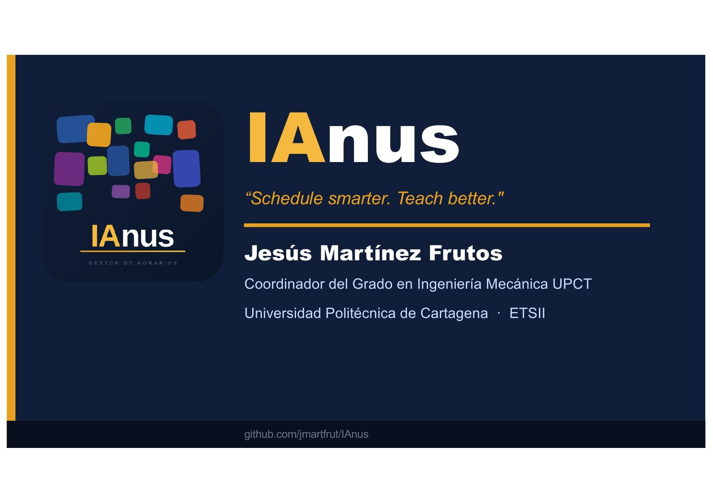

<p align="center">
  <a href="docs/presentacion.pdf">
    
  </a>
</p>

> 💡 **Haz clic en la imagen** para abrir la presentación en el navegador.

---

Herramienta para visualizar, editar y verificar horarios de titulaciones universitarias. Desarrollada originalmente para la **UPCT** (Universidad Politécnica de Cartagena), soporta múltiples grados de forma independiente.

Arquitectura mínima: servidor Python local + base de datos SQLite + frontend HTML/JS en un solo fichero. Sin dependencias de framework, sin instalación compleja.

---

## Características

- **4 vistas**: Semana, Todas las semanas, Estadísticas y Parciales
- **Edición en línea**: crear, modificar y eliminar clases directamente desde el navegador
- **Verificación automática**: horas reales vs. fichas docentes (AF1/AF2/AF4) con badges verde/rojo
- **Detección de conflictos**: solapamientos de turno entre cursos consecutivos en la vista Parciales
- **Exportación PDF**: semana individual o curso completo (multipágina), sin diálogo de impresión
- **Multi-grado**: cada titulación tiene su propia carpeta, BD y configuración independiente
- **Calendario configurable**: festivos, vacaciones y días no lectivos por cuatrimestre
- **Compatible con Dropbox/OneDrive**: los launchers copian la BD a `/tmp` (macOS) o `%TEMP%` (Windows) antes de arrancar
- **Multiplataforma**: launchers `.command` para macOS, `.sh` para Linux y `.bat` para Windows

---

## Estructura del repositorio

```
Janux/
├── servidor_horarios.py       # Servidor + frontend completo (único fichero)
├── nuevo_grado.py             # Asistente interactivo para crear un nuevo grado
├── setup_grado.py             # Inicialización de la estructura de un grado
├── importar_horarios.py       # Importación de horarios desde Excel
├── exportar_excel.py          # Exportación a Excel
├── exportar_finales_pdf.py    # Exportación de exámenes finales a PDF
├── Grado.command              # Lanzador macOS para crear un grado
├── Grado.sh                   # Lanzador Linux para crear un grado
├── Grado.bat                  # Lanzador Windows para crear un grado
├── LICENSE.md
├── README.md
├── docs/
│   ├── logo_janux.svg         # Logo Janux (interfaz web)
│   ├── logo.svg               # Logo institucional (SVG)
│   ├── logo.pdf               # Logo institucional (PDF, fuente)
│   ├── logo.png               # Logo institucional (PNG, generado)
│   └── logo_upct.png          # Logo institucional alta resolución (generado)
└── grados/                    # ⚠️ No versionado — generado localmente por cada instalación
    └── <NOMBRE_GRADO>/
        ├── config.json
        ├── horarios.db
        ├── fichas.pdf
        ├── HORARIOS/          # Ficheros fuente de horarios (Excel y PDF)
        ├── Iniciar Horarios <GRADO>.command   # macOS
        ├── Iniciar Horarios <GRADO>.sh        # Linux
        └── Iniciar Horarios <GRADO>.bat       # Windows
```

---

## Arrancar el servidor

### macOS — forma recomendada

Doble clic en el fichero `.command` del grado correspondiente. Los launchers copian la BD a `/tmp` antes de arrancar para evitar errores de I/O en carpetas sincronizadas (Dropbox, OneDrive, iCloud).

### Linux (Ubuntu / Debian)

Ejecutar el fichero `.sh` desde terminal:

```bash
bash "grados/GIM/Iniciar Horarios GIM 2627.sh"
```

Requiere `lsof` y `curl` instalados (`sudo apt install lsof curl`). El navegador se abre automáticamente con `xdg-open`.

### Windows

Doble clic en el fichero `.bat` del grado correspondiente.

**Prerequisito — Python 3.9 o superior:**
1. Descarga el instalador desde [python.org/downloads](https://www.python.org/downloads/)
2. Durante la instalación, marca **"Add Python to PATH"** (imprescindible)
3. Completa la instalación y haz doble clic en el `.bat`

Si Python no está instalado, el launcher mostrará un mensaje de error con estas mismas instrucciones.

> ⚠️ **Importante:** para que los cambios en el horario se guarden correctamente, cierra el servidor **pulsando cualquier tecla** en la ventana de comandos, no con el botón X. Al cerrar con la X el proceso termina sin copiar la base de datos de vuelta.

### Manual

```bash
# Grado GIM (2026-2027)
CONFIG_PATH_OVERRIDE="grados/GIM" python3 servidor_horarios.py

# Grado GIDI
CONFIG_PATH_OVERRIDE="grados/GIDI" python3 servidor_horarios.py

# Si el puerto está ocupado
kill $(lsof -ti:8080) && python3 servidor_horarios.py
```

Abre el navegador en `http://localhost:8080`.

---

## Añadir un nuevo grado

Desde la propia aplicación, mediante la interfaz gráfica.

---

## Base de datos

SQLite con 6 tablas: `asignaturas`, `grupos`, `semanas`, `clases`, `fichas`, `franjas`.

El tipo de actividad se codifica en el campo `aula` de `clases`:

| Valor de `aula` | Tipo |
|-----------------|------|
| `""` (vacío) | AF1 — Teoría |
| `"LAB"` | AF2 — Laboratorio |
| `"INFO"` / `"Aula:…"` | AF4 — Informática |
| Otro texto | PS — Puesto singular |

Los días marcados como `es_no_lectivo=1` bloquean la columna entera en la vista de semana.

---

## Configuración (`config.json`)

Cada grado se define completamente en su `config.json`. Secciones principales:

- **`institution`** — nombre, acrónimo y logos
- **`degree`** — nombre y acrónimo de la titulación
- **`server`** — puerto, nombre de la BD y etiqueta del curso
- **`degree_structure`** — número de cursos, grupos por cuatrimestre y franjas horarias
- **`calendario`** — fechas de inicio/fin, festivos y vacaciones por cuatrimestre
- **`branding`** — colores corporativos (CSS)
- **`activity_types`** — definición de AF1/AF2/AF4 (patrones de campo `aula`)
- **`ui`** — badge de asignaturas destacadas y prefijo de exportación

---

## Vistas

### Semana
Grilla lunes-viernes × 6 franjas horarias (9:00–21:00, bloques de 2 horas). Panel lateral con horas acumuladas por asignatura. Navegación por semana y grupo. Exportación PDF directa.

### Todas
Scroll vertical de las 16 semanas del cuatrimestre. Exportación PDF multipágina.

### Estadísticas
Tabla de horas reales impartidas vs. horas declaradas en fichas docentes (AF1, AF2, AF4). Badge verde si coinciden, rojo si hay desviación. Desglose por subgrupo para laboratorio e informática.

### Parciales
Calendario global de exámenes parciales. Detección automática de conflictos de turno entre cursos consecutivos (1º-2º, 2º-3º, 3º-4º).

---

## Dependencias

**Python** (≥ 3.9):
```bash
pip install pdfplumber openpyxl --break-system-packages
```

**JavaScript** (cargadas desde CDN, sin instalación):
- [html2canvas 1.4.1](https://cdnjs.cloudflare.com/ajax/libs/html2canvas/1.4.1/html2canvas.min.js)
- [jsPDF 2.5.1](https://cdnjs.cloudflare.com/ajax/libs/jspdf/2.5.1/jspdf.umd.min.js)

---

## API

El servidor expone los siguientes endpoints JSON:

| Método | Endpoint | Descripción |
|--------|----------|-------------|
| `GET` | `/api/schedule` | Datos completos (franjas, asignaturas, grupos, fichas) |
| `POST` | `/api/clase/update` | Actualizar una clase existente |
| `POST` | `/api/clase/create` | Crear una clase nueva |
| `POST` | `/api/clase/delete` | Eliminar una clase |
| `POST` | `/api/asignatura` | Crear o actualizar una asignatura |

---

## Licencia

MIT © 2026 Jesús Martínez
